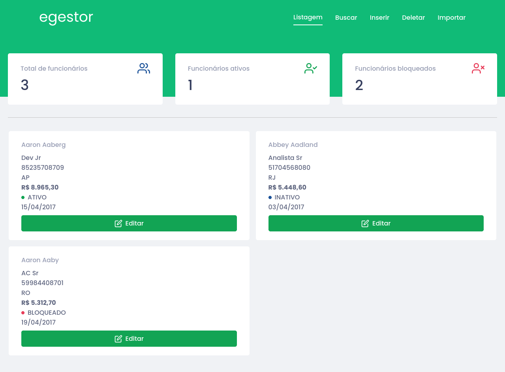

## Instalação
Use o git [clone](https://git-scm.com/docs/git-clone) para clonar o repositório. Então instale as dependencias com yarn.
```bash
git clone https://github.com/hugoms154/frontend-egestor.git
cd frontend-egestor

yarn install
```

## :arrow_forward: Scripts disponíveis

No diretório do projeto, você pode executar:

### `yarn start`

Executa a aplicação em modo de desenvolvimento.<br />
Abra [http://localhost:3000](http://localhost:3000) para abrir no navegador.

### `yarn build`
Constroi a aplicação para produção para pasta `build`.<br />

### `yarn eject`

**Atenção: essa operação não pode ser desfeita. Uma vez que você tenha feito `eject`, não poderá voltar atrás!**


## Layout

### :black_large_square: Desktop


### :black_medium_square: Medium devices


### :black_medium_small_square: Small devices


## :question: Saiba mais

Saiba mais em [Create React App documentation](https://facebook.github.io/create-react-app/docs/getting-started).

Para saber mais sobre o React, acesse [React documentation](https://reactjs.org/).
